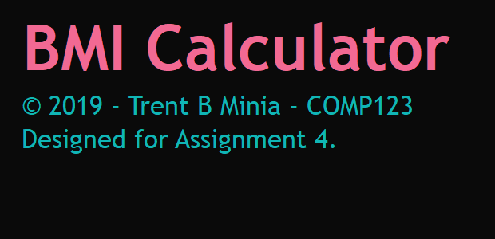
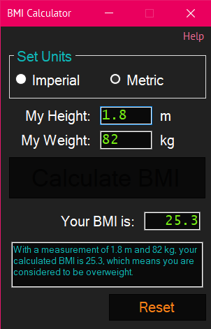
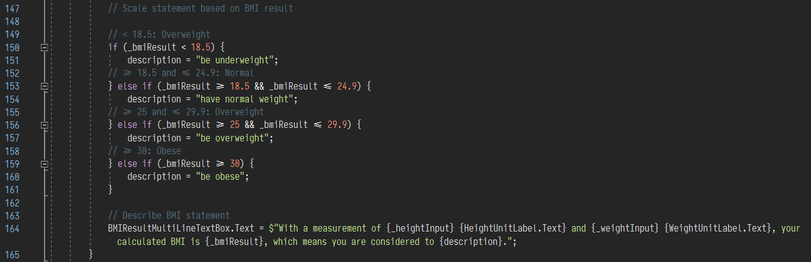
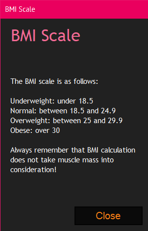

# BMI Calculator

**Assignment 4 | COMP123 Programming II**
**Centennial College**

This is the git repository for BMI Calculator. BMI Calculator was created as an 
assignment for COMP123 Programming II at Centennial College. 

# Overview of Features

Upon starting the application, the application's splash screen will show for a 
few seconds.

Once the splash screen disappears, the main UI will appear. From here, the user 
will be able to select which system of unit they want to use. The following may 
be selected: 

 * Imperial
 * Metric (this is the default)

The user may then enter their height in m/inch or kg/lbs. The labels that display
the units will change depending on the system of units chosen earlier. The 
**Calculate BMI** button will only be enabled if the text fields for _My Height_ 
and _My Weight_ are correctly filled in. The text fields will only accept whole 
numbers and decimal numbers greater than 0.

Once the **Calculate BMI** button is clicked, the BMI result will be shown, and 
the explanation of the calculation will be explained in the text field below. The 
user can reset the form by clicking the **Reset Button** and all fields will be 
reset to blank.

A look at the code shows all of the possible responses the result text field 
will show:

An explanation of the BMI Scale can be found by accessing the Help > View BMI 
Scale menu at the top. A new window will appear that explains the BMI Scale.

# Requirements

The following is a list of requirements as outlined in the assignment sheet for
Assignment 4:

## Overview

Using Windows Forms, create a BMI calculator app that allows users to enter 
their weight and height and whether they are entering these values in Imperial 
or Metric units, then calculates and displays the user's body mass index (BMI). 
The app should also display the following information from the Department of 
Health and Human Services/National Institutes of Health so the user can evaluate 
his/her BMI:

| BMI Scale | Result |
| --- | --- |
| Underweight | Less than 18.5 |
| Normal | Between 18.5 and 24.9 |
| Overweight | Between 25 and 29.9 |
| Obese | 30 or Greater |

## Instructions

1. Modify the following properties of the BMICalculator Form:
    1. The Size property must be set to 320, 480 (width and height)
    2. The Font property must have a Font Size of 20 points
    3. The FormBorderStye property must be set to FixedDialog
    4. The MaximizeBox property must be set to False
    5. The StartPosition property must be set to CenterScreen
2. The following UI Controls should be added to the BMICalculator Form:
    1. Your BMICalculator User Interface (UI) will use a TableLayoutPanel 
    container
    2. A RadioButton Control that allows the user to toggle between Imperial or 
    Metric Units. This control will affect the BMI calculation. See above for 
    the BMI formula
    3. A Label Control with a Text value of “My Height”
    4. An TextBox Control that allows the user to input his/her height in inches 
    or metres, depending on the RadioButton Control setting. Ensure that 
    appropriate input validation techniques are used to limit the user’s entry to 
    numeric data only for this control
    5. A Label Control with a Text value of “My Weight”
    6. An TextBox Control that allows the user to enter his weight in pounds or 
    kilograms. Ensure that appropriate input validation techniques are used to 
    limit the user’s entry to numeric data only for this control
    7. A BMI TextBox Control which will display the user’s BMI when the Calculate 
    BMI Button is pressed. This control will be disabled for any user input but 
    will have background and foreground colours adjusted appropriately
    8. A Button control with a Text value of “Calculate BMI” that displays the 
    user’s calculated BMI in the BMI TextBox Control. Any method used to calculate 
    the user’s BMI will use either imperial or metric units, depending on the unit 
    type selected with the RadioButton Control
    9. A Multiline TextBox Control that displays the user’s BMI results as per 
    the BMI Scale above
3. Solution Structure (3 Marks: Program Structure):
    1. Your solutions should include a Windows Form named BMICalculator.cs
    2. The Windows Form and all attached UI Controls must have appropriate 
    Variable names with the following format: ControlNameUIControlType 
    (e.g. CalculateBMIButton)
    3. Ensure all private class member variables (instance variables) use an 
    underscore character (_) at the beginning of the identifier name to signify 
    that they are private (or protected)
4. Internal Documentation (6 Marks: Internal Documentation):
    1. Ensure you include a program header that indicates: The Author's name, 
    Author’s student number, Date last Modified, Program description, Revision 
    History for each project in your 
    2. Ensure your program uses contextual variable names that help make each 
    program human-readable 
5. Share your files on GitHub to demonstrate Version Control Best Practices
    1. Your repository must include your code and be well structured. Your 
    repository must include commits that demonstrate the project being updated 
    at different stages of development – each time a major change is implemented

# Disclaimer

I was very proud of how my implementation of Assignment 4 BMI Calculator had 
turned out. It is one of the assignments from COMP123 at Centennial College that 
I've decided to showcase for my personal website. With that said, it is possible 
that the instructions for this assignment are unchanged, or have been slightly 
modified since I took the course. I am _not responsible_ for any plagiarism that 
takes place in the event that my code is copied and submitted for evaluation.